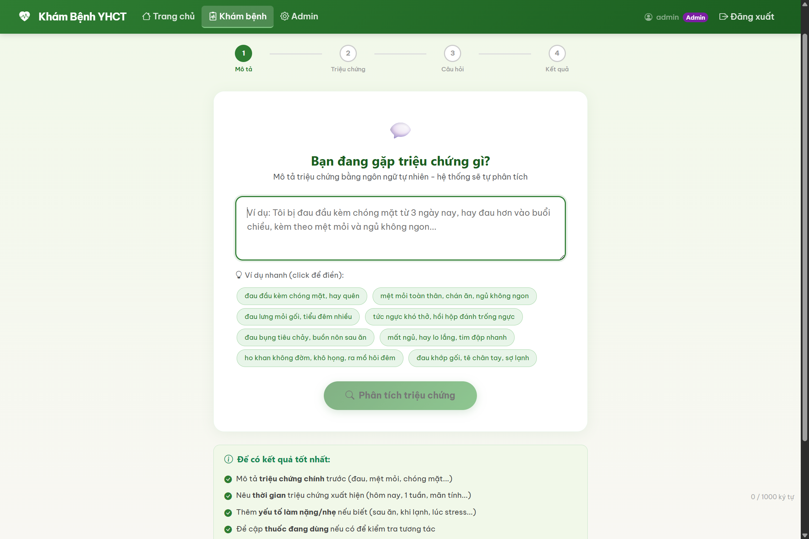
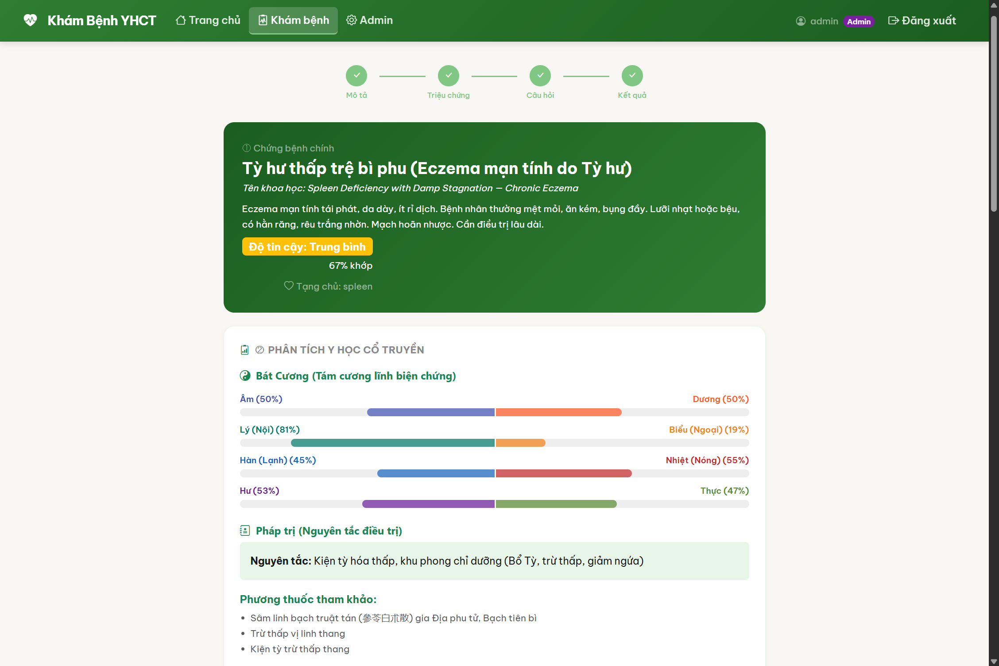

# Kham — Hệ thống Hỗ trợ Chẩn đoán Y Học Cổ Truyền

Ứng dụng web PHP hỗ trợ chẩn đoán theo Y Học Cổ Truyền Việt Nam (YHCT), tích hợp cơ sở tri thức Bát Cương, Tạng phủ, K04 chứng hội và cảnh báo an toàn thuốc.





## Tính năng

### Luồng khám bệnh
1. **Mô tả triệu chứng** — Bệnh nhân nhập mô tả tự do (ví dụ: "tôi bị ngứa chân")
2. **Làm rõ** — Hệ thống hỏi thêm: vị trí, thời gian, mức độ, diễn biến
3. **Chọn triệu chứng** — Bộ chọn triệu chứng có gợi ý thông minh (1852 triệu chứng)
4. **Câu hỏi nhanh** — Lưỡi, mạch, tiền sử thuốc, cảm xúc
5. **Kết quả** — Phân tích đầy đủ YHCT: Bát Cương, Tạng phủ, K04 chứng hội, phác đồ điều trị

### Engine chẩn đoán YHCT
- **K02** — 1852 triệu chứng có alias tiếng Việt và phân loại tạng phủ
- **K04** — 134 chứng hội (pattern) với required/optional/supporting symptoms, phép trị, phương thuốc, huyệt vị
- **Bát Cương** — Âm/Dương, Biểu/Lý, Hàn/Nhiệt, Hư/Thực
- **Skin patterns** — 5 chứng hội da liễu (ngứa do huyết nhiệt, huyết hư, thấp nhiệt, tỳ hư, phong nhiệt)
- **Cảnh báo đỏ** — 70 red flags theo 4 mức độ nguy hiểm
- **Cảnh báo thuốc** — 120 cặp herb-drug interaction, cảnh báo thai kỳ, trẻ em
- **Reverse matching** — Khớp triệu chứng từ mô tả tự do (forward + reverse token matching)

### Quản trị
- Dashboard thống kê phiên khám
- Quản lý KB: triệu chứng, chứng hội, red flags, herb-drug interactions
- Embedding management: xem trạng thái, reset, seed lại tài liệu
- Clinical test runner

## Cài đặt

### Yêu cầu
- PHP 8.1+ với extension: `pdo_sqlite`, `mbstring`, `json`
- XAMPP hoặc bất kỳ web server có PHP
- SQLite (đã tích hợp sẵn trong PHP)

### Các bước

```bash
# Clone về thư mục web server
git clone https://github.com/ntanhprt/kham_v1.git kham

# Database đã có sẵn tại app/storage/kham.db
# Không cần chạy migration thêm

# Đặt quyền ghi cho thư mục storage
chmod -R 755 app/storage/
```

Trỏ web server về thư mục `app/` hoặc cấu hình VirtualHost theo đường dẫn.

### Tài khoản mặc định
| Username | Password | Quyền |
|----------|----------|-------|
| admin    | _(xem DB)_ | Admin |
| doctor1  | _(xem DB)_ | Bác sĩ |

Khách (chưa đăng nhập) vẫn có thể sử dụng luồng khám bình thường.

## Cấu trúc thư mục

```
app/
├── config.php              # Cấu hình app, DB, session
├── index.php               # Entry point
├── core/
│   ├── App.php             # Router
│   ├── Auth.php            # Xác thực session
│   ├── Controller.php      # Base controller
│   ├── Database.php        # PDO singleton (SQLite)
│   └── disease_vi.php      # Tên bệnh tiếng Việt
├── controllers/
│   ├── ExamController.php  # Luồng khám (start→clarify→symptoms→questions→result)
│   ├── AdminController.php # Quản trị + API
│   ├── AuthController.php  # Đăng nhập/đăng xuất
│   └── DoctorController.php
├── engine/
│   ├── YHCTEngine.php      # Engine chính: parse, match, score, diagnose
│   ├── RedFlagEngine.php   # Cảnh báo nguy hiểm
│   ├── SafetyFilter.php    # Herb-drug, thai kỳ, chống chỉ định
│   ├── ClusterEngine.php   # Phân nhóm triệu chứng
│   ├── HypothesisEngine.php
│   └── BackwardReasoningEngine.php
├── models/
│   ├── BaseModel.php
│   ├── ExamSessionModel.php
│   ├── KBModel.php
│   └── UserModel.php
├── views/
│   ├── _layout.php
│   ├── exam/               # start, clarify, symptoms, result
│   ├── admin/
│   └── auth/
└── storage/
    └── kham.db             # SQLite database (KB + sessions)

scripts/                    # Maintenance scripts (không deploy lên production)
├── add_skin_patterns.php   # Thêm chứng hội da liễu
├── seed_embedding_documents.php
└── ...
```

## Cơ sở dữ liệu

SQLite tại `app/storage/kham.db`:

| Bảng | Mô tả |
|------|-------|
| `kb_symptoms` | 1852 triệu chứng (code, name_vi, organ_system, aliases) |
| `symptom_aliases` | 3563 alias tiếng Việt cho triệu chứng |
| `kb_patterns` | 134 chứng hội K04 |
| `kb_red_flags` | 70 cảnh báo đỏ |
| `kb_herb_drug` | 120 tương tác thuốc-thảo dược |
| `kb_clusters` | 60 nhóm triệu chứng |
| `kb_observable_phrases` | 300 cụm từ quan sát |
| `exam_sessions` | Phiên khám bệnh |
| `embedding_documents` | Tài liệu chuẩn bị cho embedding |
| `users` | Tài khoản |

## Thuật toán chấm điểm K04

Pattern score = **60%** từ required symptoms coverage + **40%** từ two_or_more_of + supporting symptoms.

Ngưỡng hiển thị: ≥ 0.10.

## License

Dự án nội bộ — chỉ dùng cho mục đích nghiên cứu và giảng dạy YHCT.
